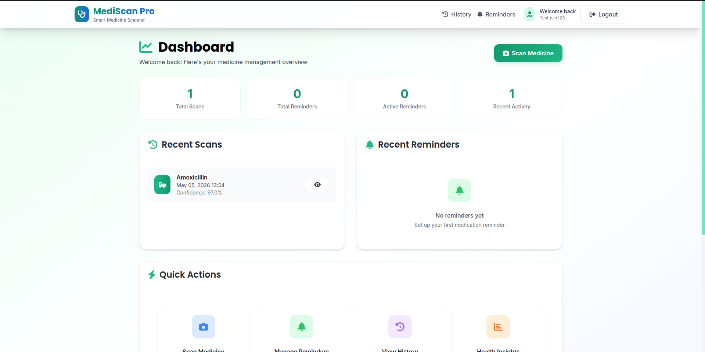
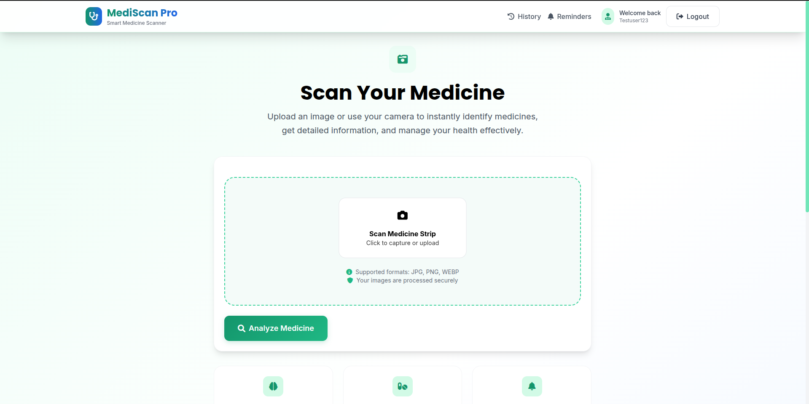
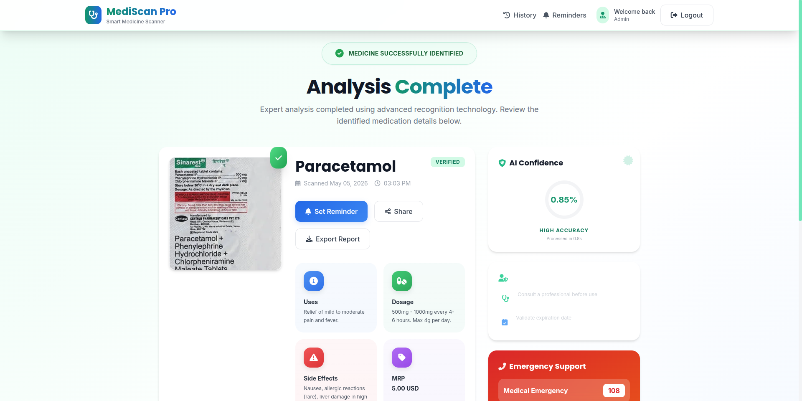
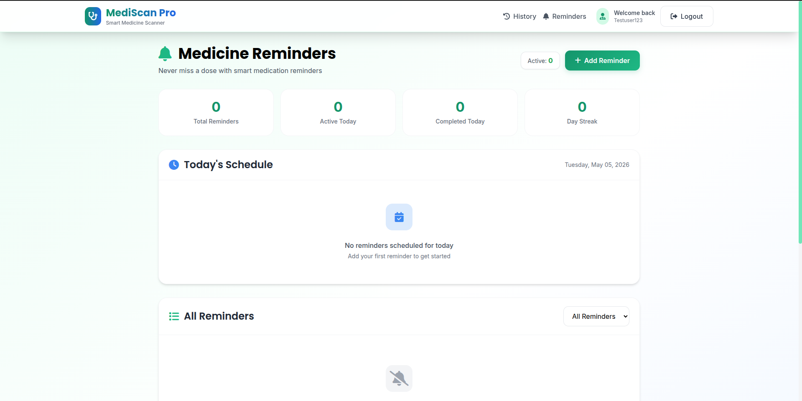
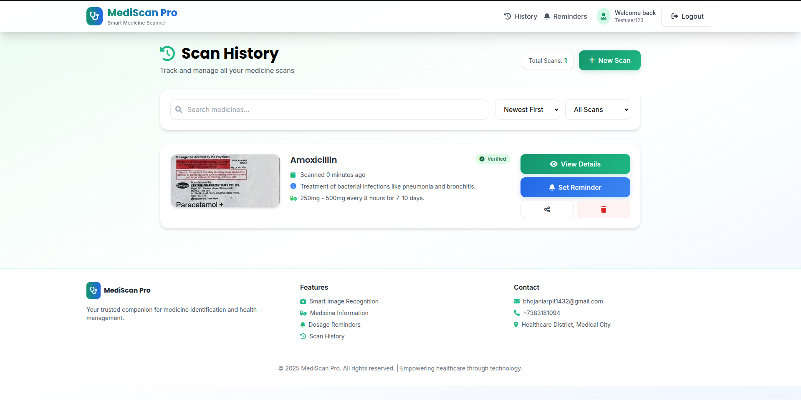
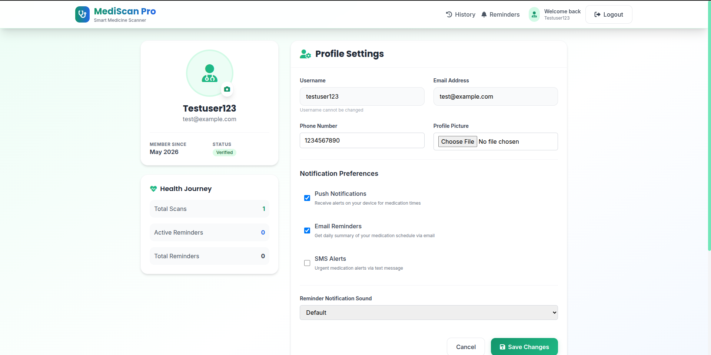
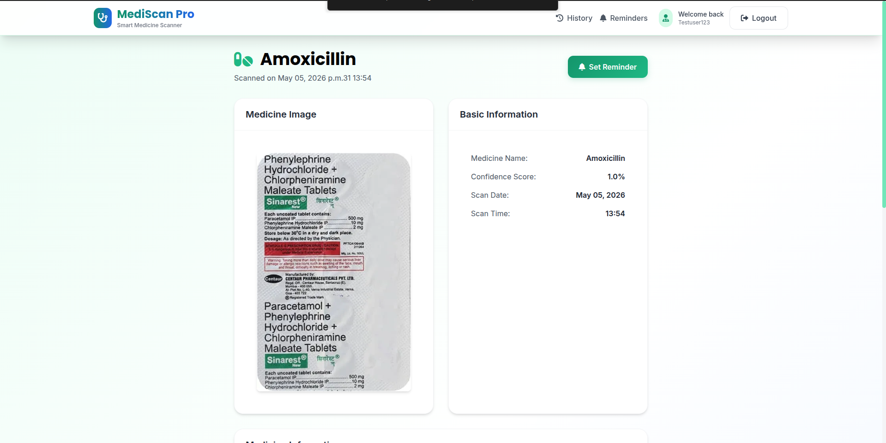

# MediScan Pro - Smart Medicine Management

[](https://www.djangoproject.com/)
[](https://tailwindcss.com/)
[](https://web.dev/progressive-web-apps/)

**MediScan Pro** is a state-of-the-art medicine management platform designed to simplify healthcare through AI-powered medicine scanning, smart reminders, and comprehensive health tracking.

---

## System Architecture

```text
                                  +---------------------------------------+
                                  |            User Interface             |
                                  |      (Responsive Web / PWA App)       |
                                  +-------------------+-------------------+
                                                      |
                                                      | HTTPS
                                                      v
                                  +-------------------+-------------------+
                                  |         Reverse Proxy / WSGI          |
                                  |          (Nginx / Gunicorn)           |
                                  +-------------------+-------------------+
                                                      |
                                                      |
          +-------------------------------------------v-------------------------------------------+
          |                                  Django Core Application                              |
          |  (Auth System, Scan Processor, Reminder Scheduler, Health Analytics, API Gateways)     |
          +----------+-----------------------+-------------------------+--------------------------+
                     |                       |                         |
          +----------v----------+  +---------v----------+  +-----------v-----------+
          |      Database       |  |   Cache & Tasks    |  |    External APIs      |
          | (PostgreSQL/SQLite) |  |   (Redis/Celery)   |  |  (AI Vision Services) |
          |                     |  |  *Session/Insights |  |  *Medicine Database   |
          +---------------------+  +--------------------+  +-----------------------+
```

---

## Key Features

*   **AI Smart Scan**: Advanced image processing to identify medicines from packaging.
*   **Intelligent Reminders**: Customizable schedules (Daily, Twice daily, etc.) with notification support.
*   **Health Insights**: Visual analytics of your medication adherence and scanning history.
*   **Secure Auth**: Robust user registration and login system with Profile management.
*   **PWA Support**: Installable on mobile and desktop for an app-like experience.
*   **Data Export**: Export your entire medication history in JSON format.

---

## Visual Preview

### Dashboard & Analytics


### Medicine Scanning



### Reminders & History



### Profile & Details



---

## Technology Stack

### Backend
- **Framework**: [Django 4.2](https://www.djangoproject.com/) (Python)
- **Database**: SQLite (Development) / PostgreSQL (Production)
- **Task Queue**: Redis for caching and background operations
- **Image Handling**: Pillow (Python Imaging Library)

### Frontend
- **Styling**: [Tailwind CSS](https://tailwindcss.com/) (Modern utility-first framework)
- **Icons**: FontAwesome 6.0
- **Logic**: Vanilla JavaScript (ES6+)
- **Templates**: Django Template Language (DTL)

---

## Installation & Setup

### Prerequisites
- Python 3.8+
- Redis (optional, for advanced caching)

### Steps

1.  **Clone & Navigate**
    ```bash
    git clone <repository-url>
    cd MediScan
    ```

2.  **Environment Setup**
    ```bash
    python3 -m venv venv
    source venv/bin/activate  # Windows: venv\Scripts\activate
    pip install -r requirements.txt
    ```

3.  **Database Initialization**
    ```bash
    python3 manage.py makemigrations
    python3 manage.py migrate
    python3 manage.py createsuperuser # Create admin account
    ```

4.  **Run Server**
    ```bash
    python3 manage.py runserver
    ```

---

## Project Structure

```text
MediScan/
├── medicine_scanner/       # Project Configuration
│   ├── settings.py         # Global Settings (Auth, DB, Redis)
│   └── urls.py             # Root URL Routing
├── scan_app/               # Main Application Logic
│   ├── models.py           # UserProfile, MedicineScan, Reminder
│   ├── views.py            # Authentication & Dashboard Controllers
│   ├── forms.py            # Custom User & Reminder Forms
│   ├── templates/          # Modern HTML UI Components
│   └── static/             # Assets (CSS, JS, Images)
├── media/                  # User Uploaded Scans & Profiles
└── manage.py               # Management Entry Point
```

---

## Security Features

- **CSRF Protection**: Enabled on all state-changing forms.
- **Password Hashing**: Uses Django's industry-standard PBKDF2 algorithm.
- **Secure Sessions**: Configuration for HTTPS and secure cookies in production.
- **Data Privacy**: One-to-one user data isolation.

---

## License

This project is licensed under the MIT License - see the LICENSE file for details.

## Support

For support and questions:
- Create an issue in the repository
- Contact the development team

## Roadmap

- [ ] Real AI integration for medicine recognition
- [ ] Mobile app development
- [ ] Advanced analytics and reporting
- [ ] Integration with healthcare providers
- [ ] Multi-language support
- [ ] Offline functionality 